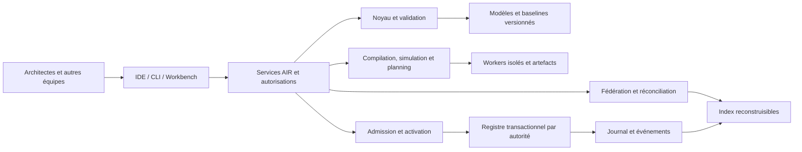

# AIR - analyse complète et plan de développement

Date : 19 septembre 2026. Source : white paper AIR 1.1, profil AIR 0.1 et extension air.activation/0.1. Statut : plan enregistré, orientation SQLite/local acceptée et réalisation commencée.

**Recommandation : construire AIR comme un produit d’ingénierie installable, composé d’un noyau déterministe, d’un protocole ouvert, d’un atelier multiclient et d’un kit d’adoption.** L’agent assiste ; les sources versionnées conservent la mémoire ; le moteur vérifie ; les autorités décident et engagent.

Le répertoire initial ne contenait que le PDF. Le plan est maintenant enregistré et une première tranche installable est réalisée : voir l’[état d’implémentation](etat-implementation.md). Les commandes cibles du paper restent à distinguer des commandes effectivement livrées.

## 1. Périmètre de l’implémentation complète

La cible couvre les cinq dimensions définies p. 6 : AIR Model, Method, Engine, Protocol et Workbench ; les cinq profils Core, Construct, Simulate, Federate, Operate (pp. 8–9) ; et l’extension d’activation (pp. 73–77). Version du produit, version du langage et version d’extension restent distinctes : le produit pourra atteindre sa version 1.0 en implémentant le profil documentaire AIR 0.1.

Une entreprise doit pouvoir :

1. Installer, administrer et mettre à niveau AIR dans son environnement autorisé.
2. Déclarer autorités, classifications, sources, bibliothèques, modèles IA et politiques.
3. Initialiser un projet depuis un template et collaborer depuis plusieurs IDE et une interface web.
4. Transformer besoins et sources en propositions sourcées avec hypothèses et inconnues.
5. Construire un modèle typé, comparer les options et produire les contrats et dossiers de construction.
6. Exécuter règles, expériences et plans capacitaires reproductibles selon leur régime déclaré.
7. Composer les projets, traiter les conflits et engager les ressources dans les registres compétents.
8. Revalider puis autoriser un épisode différé, suspendu ou replanifié.
9. Relier livraisons et observations au modèle, transférer la responsabilité vers un actif durable et organiser son retrait.
10. Sauvegarder, restaurer et exporter sans perdre les engagements ni la traçabilité autorisée.

« N’importe quelle entreprise » devient un objectif vérifiable : configuration sans fork du noyau, formats exportables, absence de cloud ou fournisseur IA imposé, modes d’hébergement multiples et extensions qualifiées. Chaque entreprise renseigne ses mandats et contraintes. La compatibilité avec tous les SI et futurs clients IA se démontre par qualification, pas par une déclaration universelle.

Le noyau couvre interactions humaines et physiques, design, médias, formation et activités opérationnelles. Les extensions sectorielles, simulateurs robotiques spécialisés et connecteurs vers chaque produit du marché relèvent du SDK ; la conformité du noyau ne les fournit pas implicitement.

## 2. Résultat de la lecture du white paper

Les 81 pages ont été lues ; les cinq figures structurantes et les tableaux techniques sensibles ont été inspectés visuellement. L’inventaire confirme **138 types de base + 5 d’activation = 143**, **72 règles de base + 12 d’activation = 84**, **15 opérations D.5 + 3 F.5 = 18**. Alias, valeurs de kind, records embarqués et projections ne sont pas ajoutés artificiellement à ce décompte.

| Apport du paper | Conséquence de développement |
| --- | --- |
| Graphe typé, bitemporel, provenance, révisions immuables | Développer un langage et un validateur de graphe ; JSON Schema seul ne suffit pas. |
| Connaissance qualifiée | Distinguer inconnu, faux, contradictoire et non applicable ; conserver origine et portée. |
| Contrat sémantique avant binding | Vérifier comportement et pertes de transformation au-delà du schéma API. |
| Compilation et génération distinctes | Aucun appel LLM caché dans une validation déterministe. |
| Quatre reproductibilités | Tester séparément modèle, expérience, plan et build ; capturer les sorties génératives acceptées. |
| Fédération et aménagement | Index reconstruisibles ; décisions transverses ayant leur propre autorité. |
| Admission coordonnée | Transactions, idempotence, concurrence, approbations et reprise sont centrales. |
| Activation temporelle | Un plan admis passe encore un contrôle de lancement sur fenêtre et versions précises. |
| Mémoire durable | Les conversations ne sont pas le référentiel de l’entreprise. |

Les difficultés principales sont la sémantique des règles, l’autorisation fine, les engagements concurrents, la coordination entre autorités et la qualité des sources capacitaires. Une interface seule ne prouve aucune de ces propriétés.

## 3. Architecture recommandée

Conserver le chapitre 18 : monolithe modulaire pour le noyau, workers isolés pour les calculs, registre d’admission par domaine de cohérence. Extraire un service seulement pour une raison démontrée d’isolation, d’exploitation ou de volume.

Choix initial accepté : Python pour domaine et calculs ; SQLite embarqué, fichiers locaux et authentification par jetons locaux générés automatiquement ; installation par une commande et un SKILL.md portable. Tous les modules devront fonctionner sous SQLite. PostgreSQL et OIDC sont des options indépendantes pour une exploitation plus conséquente. HTTP et MCP visent les mêmes services ; TypeScript reste envisagé pour le Workbench ; Git conserve modèles et recettes. Stockage d’objets distant, graphe spécialisé et index vectoriel sont optionnels. Les dépendances de la première tranche sont contraintes dans constraints.txt. Voir [ADR-19](adr/0019-sqlite-et-identite-locale.md) et [installation](installation.md). Aucun abonnement ou hébergeur n’est imposé.

Voir l’[architecture détaillée](architecture.md).

## 4. Découpage en lots

Chaque lot possède une réception propre. Les contrats restent communs et chaque incrément produit un parcours utilisable de bout en bout. Les charges sont des semaines-personnes (SP), toutes spécialités de réalisation confondues, avant réserve.

| Lot | Résultat | Charge initiale |
| --- | --- | ---: |
| L00 | Spécification, ADR, périmètre et cas de référence | 4–6 SP |
| L01 | Noyau, types, références, temps et normalisation | 8–12 SP |
| L02 | AIR-Expr, règles, rapports et portes | 10–16 SP |
| L03 | Template projet, CLI, baselines et CI | 6–10 SP |
| L04 | Identités, autorisations, services, jobs et audit | 10–16 SP |
| L05 | MCP, skills communs et adaptateurs IDE | 6–10 SP |
| L06 | Ingestion, sources et connaissance qualifiée | 8–12 SP |
| L07 | Contrats, construction et compilation | 10–16 SP |
| L08 | Workbench, vues et collaboration | 10–16 SP |
| L09 | Expériences isolées, simulations et replay | 10–16 SP |
| L10 | Plans et capacité humaine/agentique | 12–18 SP |
| L11 | Packages, fédération, contextes et index | 10–16 SP |
| L12 | Réconciliation et aménagement | 8–12 SP |
| L13 | Admission et coordination multi-autorités | 12–20 SP |
| L14 | Revalidation temporelle et activation | 8–14 SP |
| L15 | Observations, dérives et actifs durables | 8–12 SP |
| L16 | Distribution, connecteurs et exploitation | 12–18 SP |
| L17 | Qualification, pilotes et transfert | 10–16 SP |

Les [fiches de lots](lots.md) donnent travaux, dépendances, responsabilités et réception. Les [inventaires](traceability/README.md) affectent chaque type, règle et opération à un lot. Les sous-travaux démarrés sont indiqués dans le backlog et l’état d’implémentation ; aucun des 18 lots majeurs n’est entièrement réceptionné. Une tranche livrée ne clôt pas automatiquement son lot majeur.

## 5. Quatre incréments et une fondation préalable

| Étape | Contenu et démonstration | Cible indicative depuis le démarrage |
| --- | --- | --- |
| Fondation | L00 : contrats, cas de test, conventions, sécurité et périmètre pilote. | Semaines 1–3 |
| I1 - chaîne locale utile | L01–L03 et premières tranches L04–L08, L16–L17. Deux postes reconstruisent la même baseline ; un ingénieur comprend le dossier. | Semaines 8–12 |
| I2 - construire et expérimenter | L07, L09, L10 et extension L05–L08. Claims nominal et exception, deux plans, recette rejouée. | Mois 4–6 |
| I3 - composer et engager | L11–L14. Conflit entre projets, admission sûre, reprise différée et contrôle de lancement. | Mois 7–10 |
| I4 - exploiter et distribuer | L15–L17 et réception de tous les lots. Observation reliée à une décision, restauration, mise à niveau et installation dans une seconde entreprise pilote. | Mois 9–15 |

Les fenêtres se chevauchent : documentation, sécurité, distribution et recette commencent tôt. Les dépendances des lots conditionnent leur réception finale, sans interdire la préparation des contrats. Le CLI précède le Workbench complet.

Chaîne critique : sémantique → règles → contrats de construction → capacité → fédération/réconciliation → admission → activation → recette intégrée. L’identité, la qualité des sources et l’accord sur les autorités peuvent devenir des chemins critiques organisationnels.

## 6. Équipe et estimation

Somme initiale : **162–256 SP**, soit **810–1 280 jours-personnes** à cinq jours par semaine. Avec une réserve de risque de 25 % : environ **203–320 SP**, soit **1 015–1 600 jours-personnes** arrondis.

Hypothèse de calendrier : huit ETP affectés au produit avec 70 % de disponibilité effective, soit 5,6 SP par semaine. L’enveloppe représente environ 36–57 semaines de charge ; dépendances et délais des pilotes conduisent à une fenêtre de 9–15 mois. Avec six ETP à même disponibilité, prévoir plutôt 12–18 mois. Ce sont des estimations initiales non calibrées, pas des engagements ni des résultats d’un solveur AIR existant. La décision SQLite/local avance L16 et ajoute une matrice de qualification de deux bases et deux modes d’identité ; réestimer après la première tranche sans attribuer un gain non mesuré.

Équipe indicative : 1 responsable produit/architecture du langage, 3 ingénieurs noyau/backend, 1 ingénieur calcul/planning, 1 frontend/UX, 1 plateforme/sécurité, 1 assurance/Developer Experience. Les spécialités peuvent être réparties autrement. La participation des métiers, architectes pilotes, responsables de ressources, achats, données et exploitation est à budgéter séparément.

Aucun multiplicateur uniforme de productivité IA. Mesurer revue, corrections, coût des modèles et production acceptée ; réestimer après L00, I1 et chaque pilote en conservant les références antérieures.

## 7. Première séquence de développement (historique)

Cette section conserve l’ordre de démarrage accepté. Pour les tranches ultérieures livrées et la suite active, lire [l’état d’implémentation](etat-implementation.md).

La tranche 0.1.0.dev1 commence par installation SQLite, identité locale, stockage de brouillons, schémas Scope/Source, validation bornée, API/CLI et skill d’installation. La tranche 0.2.0.dev1 apporte références typées, baselines fermées, objets de connaissance et ChangeSet. La qualification humaine des preuves reste à construire. La tranche 0.3.0.dev1 apporte AIR-Expr borné et les portes de diagnostic, vérifiés sur les trois dossiers Asteria. Les politiques sous autorité, revues et dérogations restent ouvertes. La tranche 0.4.0.dev1 relie exigence → fonction → contrat → unité de construction, avec réception structurelle et cas de vérification décrits (L07 partiel). La prochaine tranche vise diff explicable, impacts des actifs partagés et vue de traçabilité ; droits fins et revues restent requis pour la démonstration métier. PostgreSQL partage la suite de stockage et OIDC reste optionnel. La qualification et les tests d’installation commencent dès maintenant.

Fermer d’abord cette boucle : source → assertion/hypothèse → exigence → fonction → contrat SubmitClaim → unité de construction → contrôle → baseline → vue d’ingénierie. Inclure doublon de déclaration, accès interdit et preuve manquante. La CI accepte le cas valide, explique les refus et reconstruit le résultat sur un second poste.

Ordre : formaliser records et états ; définir format canonique et fermeture ; constituer registre et fixtures ; implémenter parsing/références/normalisation ; produire règles et rapports ; ajouter template et CLI ; publier une vue locale ; qualifier le parcours dans trois clients, puis les six familles demandées.

L00 prépare tous les profils. Le premier cycle implémente un sous-périmètre explicite : il annonce ses types et règles supportés et refuse toute revendication plus large.

## 8. Démonstration dans une entreprise fictive commune

Exigence utilisateur ajoutée le 19 septembre 2026 : dès réception de DEMO-METIER-1, exécuter et présenter trois dossiers différents et crédibles dans la même installation AIR. Le jeu Asteria Industrie couvre portail SAV, maintenance connectée et cycle de vie des accès, avec identité et capacité d’intégration partagées. La [recette détaillée](demonstration-trois-dossiers.md) fixe sept critères de première démonstration ; une deuxième étape vérifie simulation, conflits capacitaires, admission et activation.

Les neuf objets de cadrage et les sources fictives sont préparés ; leurs précontrôles sont exécutables. Le précontrôle de données ne réceptionne pas le parcours métier. Aucun critère non exécuté n’est compté comme réussi. Ce jalon s’insère dans I1 puis I2/I3 sans attendre la livraison complète d’AIR.

## 9. Livraison finale

Réceptionner les cinq profils et l’extension ; les 143 types ; les 84 contrôles avec exécution automatique ou protocole humain vérifié ; les 18 opérations avec effets conformes. Un contrôle non exécuté ne compte pas comme réussi.

Ajouter installation automatisée SQLite/local sans intervention des développeurs AIR, variantes PostgreSQL/OIDC qualifiées et migration de données vérifiée, qualification de chaque client annoncé compatible, refus des doubles réservations, reprise des jobs/outbox, restauration des engagements, lecture et migration des anciennes baselines, documentation des limites et transmission indépendante.

Le critère métier est celui de la p. 39 : une autre équipe peut construire une tranche représentative sans redécouvrir les décisions structurantes. Voir [qualification](qualification.md), [installation et adoption](deploiement-et-adoption.md), [intégrations IDE](integrations-ide.md) et [décisions ouvertes](decisions-et-risques.md).
