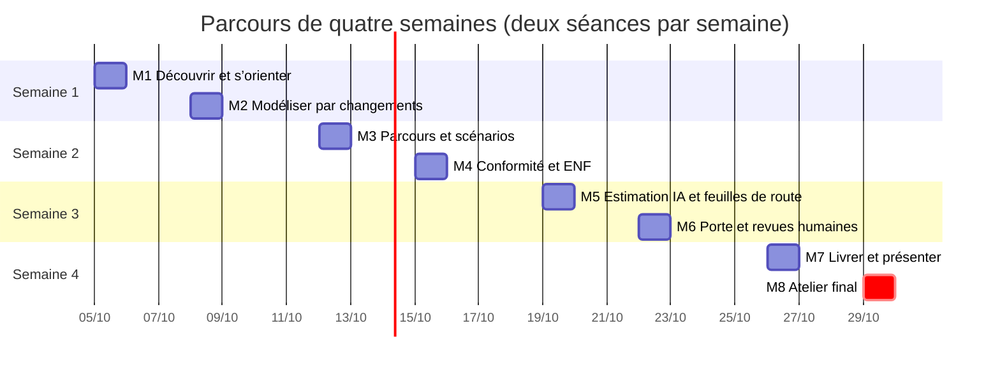
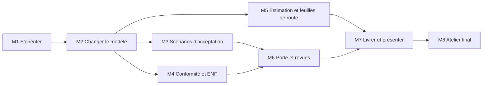
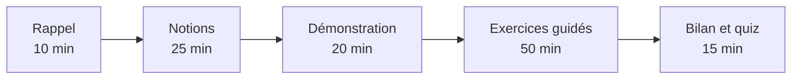

# Parcours de formation AIR pour architectes de solution

Huit séances de deux heures sur quatre semaines, plus une heure de pratique personnelle après chaque séance. Chaque
module se suit sur **deux pistes** au choix, ou les deux :

- **Piste A, avec un agent** : Claude Code (ou Codex, Cursor, OpenCode, Antigravity) dans le dépôt du référentiel,
  ou ChatGPT par le plugin AIR. Vous formulez les demandes ; l’agent appelle AIR.
- **Piste B, sans agent** : la CLI `air` et des fichiers de requête JSON.

Le guide de référence est le [guide de l’architecte de solution](../guide-architecte-solution/README.md).

## Calendrier

Les dates sont indicatives : garder deux séances par semaine et au moins deux jours entre deux séances pour la
pratique personnelle.

## Progression

| Module | Durée | Ce que vous saurez faire |
| --- | --- | --- |
| [M1 Découvrir et s’orienter](modules/m1-orienter.md) | 2 h + 1 h | Installer AIR, brancher un agent, lire l’état d’un dossier |
| [M2 Modéliser par changements](modules/m2-changer.md) | 2 h + 1 h | Proposer, valider, préparer, déposer et figer un changement |
| [M3 Parcours et scénarios](modules/m3-scenarios.md) | 2 h + 1 h | Écrire une carte de navigation et des scénarios, les rejouer |
| [M4 Conformité et ENF](modules/m4-conformite.md) | 2 h + 1 h | Recevoir contrôles et ENF du socle, les relier, nommer les responsables |
| [M5 Estimation et feuilles de route](modules/m5-estimation.md) | 2 h + 1 h | Estimer avec et sans IA, comparer des feuilles de route, lier deux projets |
| [M6 Porte et revues humaines](modules/m6-porte.md) | 2 h + 1 h | Lire la porte, préparer et faire les revues humaines |
| [M7 Livrer et présenter](modules/m7-livrer.md) | 2 h + 1 h | Produire les livrables, l’OpenAPI et le deck de direction |
| [M8 Atelier final](modules/m8-atelier.md) | 2 h | Mener un dossier de bout en bout, évalué sur grille |

## Avant la première séance

1. AIR installé et `air doctor` à `status: ok` (voir [installation](../installation.md)).
2. Un référentiel d’exercice créé depuis `examples/workspace.json` (domaines Asteria : `sav`, `atelier`,
   `identites` et `socle`).
3. Piste A : Claude Code configuré par `air ide-setup`, ou ChatGPT avec le plugin AIR rafraîchi.
4. Piste B : un terminal dans le dépôt AIR, avec `.venv` activé.

## Format de chaque séance

Chaque module donne les objectifs, le déroulé minuté, les exercices des deux pistes, la vérification attendue et
un quiz de contrôle (réponses en fin de module).

## Évaluation

L’atelier final (M8) est noté sur la grille du module : dossier cohérent, scénarios rejoués, conformité reliée,
estimation et feuilles de route justifiées, porte lue correctement, deck critiqué. Un apprenant qui présente un
critère non tenu comme tenu, ou une revue d’agent comme une revue humaine, n’obtient pas la validation.
