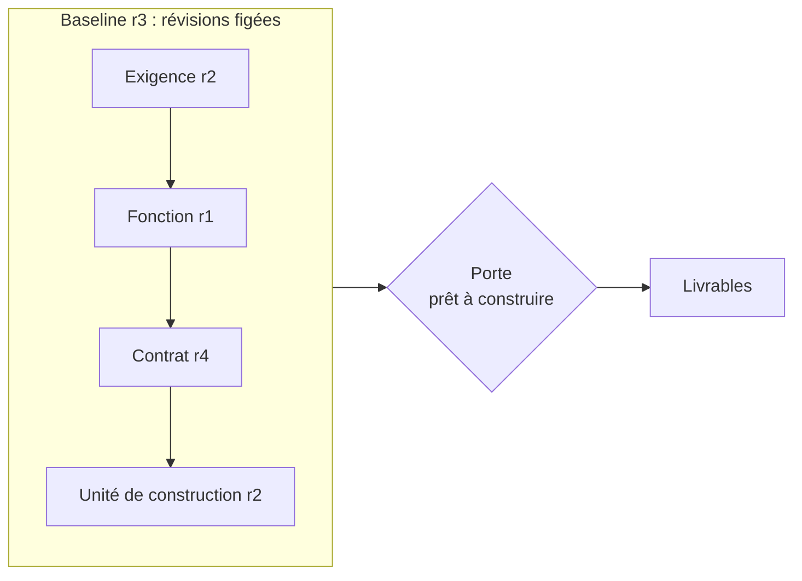

# M1 Découvrir AIR et s’orienter

**Durée** : 2 h de séance, 1 h de pratique. **Prérequis** : aucun.

## Objectifs

- Expliquer ce qu’est un objet, une révision, une baseline et un namespace.
- Installer AIR et brancher un agent sur le référentiel d’exercice.
- Lire l’état d’un dossier et son verdict prêt à construire.

## Déroulé

| Minutes | Activité |
| --- | --- |
| 0 à 10 | Tour de table : quels dossiers d’architecture tenez-vous aujourd’hui, où vivent-ils ? |
| 10 à 35 | Notions : registre, références exactes, baseline, profils, porte |
| 35 à 55 | Démonstration : `air_guide` sur un dossier, lecture de `readiness` et `next_steps` |
| 55 à 105 | Exercices 1.1 à 1.3 |
| 105 à 120 | Bilan et quiz |

## Notions

Une référence pointe toujours une **révision exacte**. Modifier un objet crée sa révision suivante ; la baseline
suivante épingle le nouvel état. Deux projets partagent des objets par **emprunt** : on épingle la révision de
l’autre, on n’écrit jamais chez lui.

## Exercices

### 1.1 Installer et vérifier

- **Piste A.** Dans le dépôt AIR, demander à Claude Code : « Installe et démarre AIR, puis vérifie qu’il répond ».
- **Piste B.** `python scripts/install.py --start`, puis `air doctor`.

Attendu : `status: ok`, service sur `http://127.0.0.1:8740`.

### 1.2 Créer le référentiel d’exercice et brancher l’agent

- **Piste A.** « Crée le référentiel Asteria depuis examples/workspace.json dans ../formation, puis configure Claude
  Code dessus. » L’agent vous montre le plan de fichiers avant d’écrire.
- **Piste B.**

~~~sh
air --home .air token-create --subject formation-agent --role editor --name formation.json
air workspace-init examples/workspace.json --workspace ../formation --apply
air ide-setup examples/claude-code.json --workspace ../formation --apply
~~~

Attendu : `domains/sav/dossier.json`, `.mcp.json`, `.claude/commands/air-dossier.md` et les skills
`air-architecte` et `air-presentation`.

### 1.3 S’orienter

- **Piste A, Claude Code.** `/air-dossier sav`
- **Piste A, ChatGPT.** « Avec AIR, où en est le domaine SAV d’Asteria ? Est-il prêt à construire ? Ne modifie rien. »
- **Piste B.** Écrire `guide.json` : `{"baseline": {"id": "<baseline_id de domains/sav/dossier.json>"}, "intent": "ORIENT"}`,
  puis `air guide guide.json`.

Attendu : vous savez dire quel critère de la porte est non tenu et qui peut le fermer.

## Vérification

- [ ] Je sais distinguer `construction_ready` et le verdict `readiness`.
- [ ] Je sais trouver la dernière révision d’une baseline.
- [ ] Je sais lire les `next_steps` et dire lequel appeler ensuite.

## Pratique personnelle (1 h)

Rejouer 1.3 sur les domaines `atelier` et `socle`. Noter pour chacun les critères non tenus.

## Quiz

1. Pourquoi une référence pointe-t-elle une révision exacte ?
2. Que signifie `NOT_APPLICABLE` pour le critère PLANNING d’un socle partagé ?
3. Un agent peut-il fermer le critère INDEPENDENT_REVIEW ?

**Réponses.** 1 : pour que ce qui est relu, jugé et livré soit exactement ce qui a été conçu. 2 : le socle ne
construit rien ; le critère ne le concerne pas. 3 : non, il faut un relecteur humain qui n’a écrit aucun objet de
la baseline.
