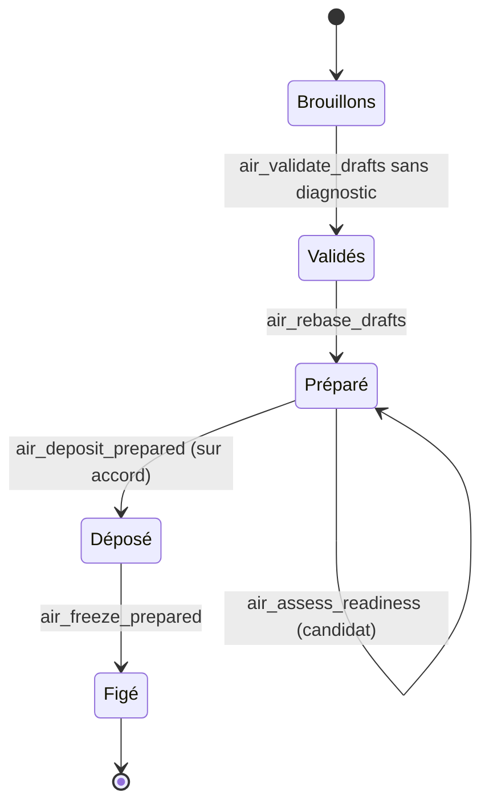

# M2 Modéliser par changements

**Durée** : 2 h de séance, 1 h de pratique. **Prérequis** : M1.

## Objectifs

- Écrire des brouillons au bon format et à la bonne révision.
- Valider à blanc, préparer, lire le verdict du candidat, puis déposer et figer sur décision.
- Réaligner un projet sur les nouvelles révisions d’un autre.

## Déroulé

| Minutes | Activité |
| --- | --- |
| 0 à 10 | Rappel M1 : baseline et références exactes |
| 10 à 35 | Notions : brouillon, changement préparé, cascade de révisions, emprunt |
| 35 à 55 | Démonstration : ajout d’une exigence et de sa fonction, de bout en bout |
| 55 à 105 | Exercices 2.1 à 2.3 |
| 105 à 120 | Bilan et quiz |

## Notions

Seuls les objets dont le contenu change sont à écrire ; AIR crée les révisions de référence des objets qui en
dépendent. Rien n’est stocké avant le dépôt : un changement préparé se jette sans trace.

## Exercices

### 2.1 Ajouter une exigence et sa fonction

- **Piste A, Claude Code.** `/air-proposer sav Un client peut suivre l’état de sa réclamation en ligne`
- **Piste A, ChatGPT.** « Avec AIR, dans le domaine SAV, propose l’exigence de suivi en ligne d’une réclamation et la
  fonction qui la satisfait. Valide à blanc et prépare, mais ne dépose rien. »
- **Piste B.** `air type-describe type.json` avec `{"type": "air.Requirement"}`, écrire deux brouillons, puis
  `air drafts-validate` et `air drafts-rebase`.

Attendu : aucun diagnostic, un `prepared_change` et le verdict de la porte sur le candidat.

### 2.2 Déposer et figer

Relire le diff montré par l’agent, puis dire « dépose et fige sous le nom Suivi des réclamations ». Piste B :
`air prepared-deposit` puis `air prepared-freeze`.

Attendu : une baseline à la révision suivante, dont `air_guide` confirme qu’elle est la dernière.

### 2.3 Réaligner un emprunt

Modifier un objet du socle emprunté par SAV, figer le socle, puis :

- **Piste A.** `/air-impact sav`
- **Piste B.** `air drafts-rebase` avec `"realign_borrowed": true`.

Attendu : `borrowed_objects_behind_latest` à zéro après le gel de SAV.

## Vérification

- [ ] Mes brouillons sont en révision 1 (nouveaux) ou dernière + 1 (modifiés).
- [ ] Je n’ai jamais écrit dans le namespace d’un autre projet.
- [ ] J’ai lu la porte du candidat avant de déposer.

## Quiz

1. Que fait `air_rebase_drafts` que vous n’avez pas à faire à la main ?
2. Pourquoi l’agent ne dépose-t-il pas sans votre accord ?
3. Comment savoir qu’un projet emprunte des révisions dépassées ?

**Réponses.** 1 : il fait avancer les références des objets dépendants et prépare la baseline suivante. 2 : déposer
engage le registre partagé ; c’est une décision d’architecte. 3 : `borrowed_objects_behind_latest` dans le guide, ou
`behind_latest` dans le critère EXTERNAL_DEPENDENCIES de la porte.
