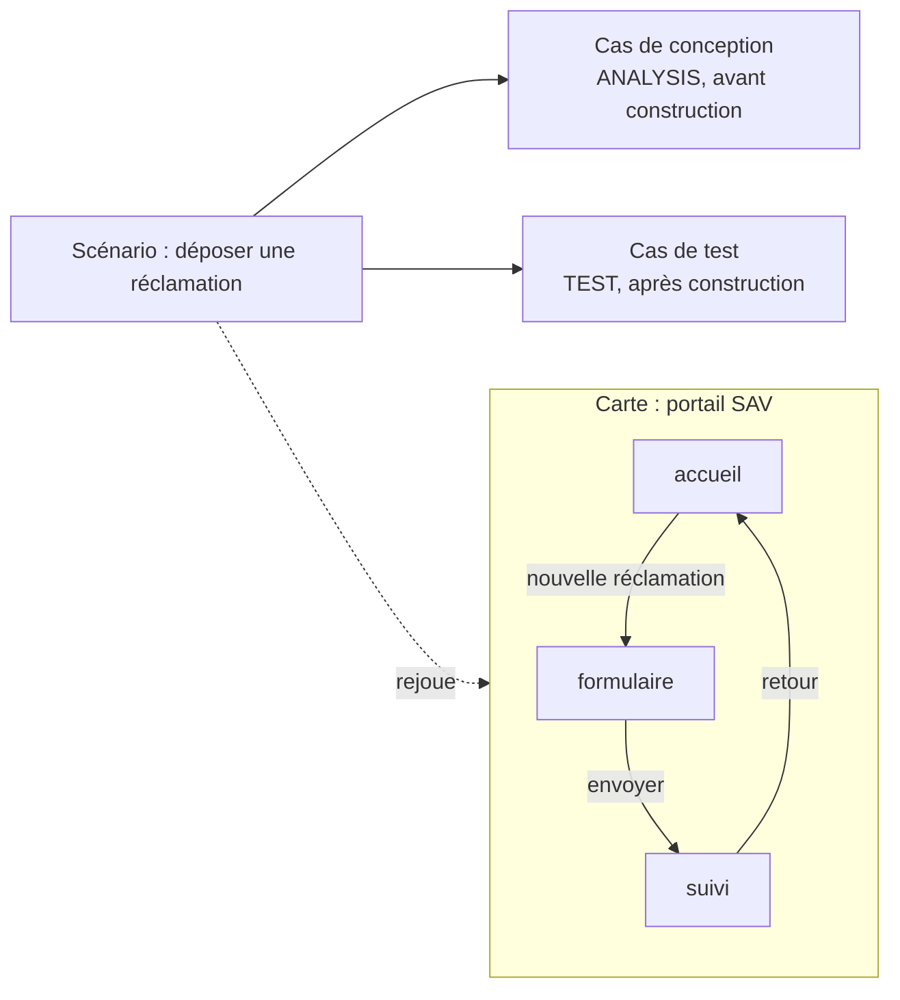

# M3 Parcours, navigation et scénarios d’acceptation

**Durée** : 2 h de séance, 1 h de pratique. **Prérequis** : M2.

## Objectifs

- Décrire les écrans et transitions d’une interface (`NavigationMap`).
- Écrire des scénarios d’acceptation par objectif de persona, avec leurs cas de conception et de test.
- Rejouer les scénarios sur la conception et corriger ce qu’ils révèlent.

## Déroulé

| Minutes | Activité |
| --- | --- |
| 0 à 10 | Rappel M2 : le cycle d’un changement |
| 10 à 35 | Notions : carte de navigation, garde, scénario, suites ACCEPTANCE, REGRESSION, SMOKE |
| 35 à 55 | Démonstration : la marche qui a trouvé la page de paiement sans issue du pilote |
| 55 à 105 | Exercices 3.1 à 3.3 |
| 105 à 120 | Bilan et quiz |

## Notions

La marche vérifie l’écran d’entrée, l’existence de chaque transition, les gardes sur le contexte du scénario,
l’opération offerte par l’écran et présente dans le contrat, et le persona. Elle mesure ensuite la couverture :
écrans, transitions, opérations, impasses.

## Exercices

### 3.1 Décrire la carte de navigation du portail SAV

- **Piste A.** « Décris la navigation du portail SAV : accueil, formulaire de réclamation, suivi, avec les
  opérations du contrat de réclamation appelées par chaque écran. Prépare sans déposer. »
- **Piste B.** Brouillon `air.NavigationMap` (forme dans `air type-describe`), puis le cycle M2.

### 3.2 Écrire deux scénarios et les rejouer

Un scénario nominal (déposer puis suivre une réclamation, suites ACCEPTANCE et REGRESSION) et un scénario qui
revient à l’accueil depuis le suivi.

- **Piste A, Claude Code.** `/air-accepter sav`
- **Piste A, ChatGPT.** « Rejoue les scénarios du SAV et dis-moi ce qui n’est pas couvert. »
- **Piste B.** `air scenarios-walk walk.json` avec `{"baseline": {…}}`.

Attendu : chaque scénario PASS ; sinon, la marche nomme l’étape et la transition manquante.

### 3.3 Corriger ce que la marche révèle

Retirer volontairement la transition « retour », rejouer, lire le FAIL, rétablir la transition.

## Vérification

- [ ] Aucune impasse non voulue dans la couverture.
- [ ] Chaque parcours client critique est exercé par un scénario de la suite REGRESSION.
- [ ] Les exécutions d’analyse rendues par la marche sont ajoutées par un changement, sur ma décision.

## Quiz

1. Pourquoi un scénario PASS sur la conception n’est-il pas une recette ?
2. Que devient un scénario de la suite REGRESSION après la construction ?
3. Quand un scénario est-il INCONCLUSIVE ?

**Réponses.** 1 : la marche vérifie le modèle, pas le logiciel construit. 2 : un test du socle de non-régression,
rejoué à chaque livraison. 3 : quand une garde dépend d’une entrée absente du contexte du scénario.
