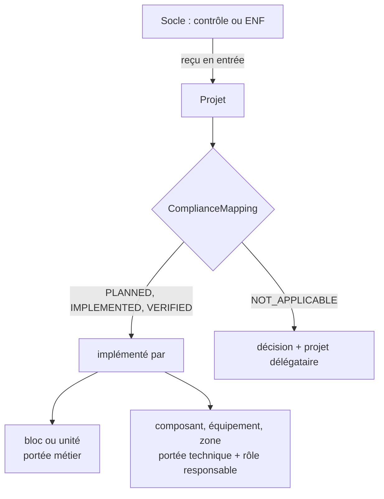

# M4 Conformité et exigences non fonctionnelles

**Durée** : 2 h de séance, 1 h de pratique. **Prérequis** : M2.

## Objectifs

- Déclarer contrôles et ENF dans le socle partagé, avec leurs cas de vérification.
- Relier chaque sujet reçu à ce qui l’implémente, ou le déléguer à un autre projet par une décision.
- Distinguer portée métier et portée technique, nommer un rôle responsable.

## Déroulé

| Minutes | Activité |
| --- | --- |
| 0 à 10 | Rappel M2 |
| 10 à 35 | Notions : sujets reçus, critère COMPLIANCE, délégation, portée |
| 35 à 55 | Démonstration : la matrice de conformité du pilote (livrable 34) |
| 55 à 105 | Exercices 4.1 à 4.3 |
| 105 à 120 | Bilan et quiz |

## Notions

La porte ne retient que les sujets du projet, ceux qu’il cite lui-même et ceux reçus d’un socle partagé : un
contrôle arrivé par simple fermeture d’un emprunt reste l’obligation de son propriétaire.

## Exercices

### 4.1 Déclarer deux sujets dans le socle

Un contrôle « chiffrement des données client » vérifié par inspection, une ENF « disponibilité 99,9 % ».

- **Piste A.** « Dans le socle Asteria, ajoute ces deux sujets avec leurs cas de vérification. Prépare, montre, puis
  dépose et fige sur mon accord. »
- **Piste B.** Brouillons `air.Control`, `air.VerificationCase`, `air.QualityRequirement` (modèles dans le skill
  `air-architecte`), puis le cycle M2.

### 4.2 Voir ce que la porte demande au SAV

- **Piste A.** « Quels contrôles et ENF reçus du socle ne sont pas reliés dans le SAV ? »
- **Piste B.** `air readiness` : lire `unmapped` dans le critère COMPLIANCE.

### 4.3 Relier, déléguer, nommer

Relier la disponibilité aux composants du portail (portée technique, responsable : le responsable de service) ;
déclarer le chiffrement sans objet pour un domaine sans données client, avec une décision et `delegated_to`.

Attendu : COMPLIANCE tenu ; dans le livrable 34, aucune ligne « sans responsable nommé ».

## Quiz

1. Pourquoi une ENF du socle s’impose-t-elle à un projet qui ne la cite pas ?
2. Que doit contenir une correspondance NOT_APPLICABLE ?
3. Qu’est-ce qui distingue une portée technique d’une portée métier ?

**Réponses.** 1 : le socle est un noyau partagé ; ses sujets sont des entrées de chaque projet qui l’emprunte.
2 : la décision qui le justifie et le projet qui l’implémente. 3 : elle n’est portée que par des composants,
équipements, connexions ou zones ; elle demande un rôle responsable.
