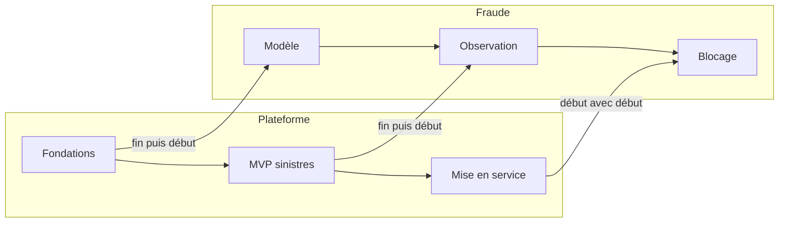

# M5 Estimation avec et sans IA, feuilles de route

**Durée** : 2 h de séance, 1 h de pratique. **Prérequis** : M2.

## Objectifs

- Répartir l’effort d’une unité par activité, sans IA et avec IA là où elle s’applique.
- Déclarer un plan d’outillage agentique et lire le coût d’abonnement.
- Comparer deux ou trois feuilles de route, recommander, lier les phases de deux projets.

## Déroulé

| Minutes | Activité |
| --- | --- |
| 0 à 10 | Rappel M2 |
| 10 à 35 | Notions : activités, effort avec IA, abonnements, référence sans IA, chemin critique |
| 35 à 55 | Démonstration : les sept conflits de dates du pilote entre fraude et plateforme |
| 55 à 105 | Exercices 5.1 à 5.3 |
| 105 à 120 | Bilan et quiz |

## Notions

!Effort sans et avec IA par unité (document historique ou livrable local non inclus)

La revue humaine et le durcissement de sécurité ne sont pas réduits par l’IA. Les réductions sont des hypothèses,
à calibrer sur les premières itérations : le deck les présente comme une prévision.

## Exercices

### 5.1 Estimer une unité avec et sans IA

- **Piste A.** « Pour l’unité de construction du portail SAV, estimée à 40 j.h, répartis l’effort par activité et
  propose l’effort avec IA ; utilise le plan d’IDE agentique du socle. »
- **Piste B.** Brouillon `air.DeliveryEstimate` (modèle dans le skill `air-architecte`) ; AIR refuse un effort avec
  IA supérieur à l’effort sans IA.

### 5.2 Comparer trois feuilles de route

Séquentielle sans IA, MVP d’abord avec IA, parallèle avec IA ; une seule RECOMMENDED avec sa justification.

Attendu : dans le livrable 37, l’écart de durée et de coût de chaque variante face à la référence sans IA.

### 5.3 Lier deux projets

Faire attendre la phase « déploiement terrain » de l’atelier sur la « mise en service » du SAV (`external_depends_on`),
avec des dates qui ne tiennent pas, puis corriger.

- **Piste A.** « Déclare la dépendance et dis-moi si les dates tiennent. »
- **Piste B.** `air drafts-validate` : lire `AIR_ROADMAP_EXTERNAL`.

## Quiz

1. Pourquoi comparer à la feuille de route sans IA du même projet ?
2. Que signale AIR si la fraude dépend d’une feuille de route que la plateforme n’a pas retenue ?
3. Le coût d’abonnement du deck vient-il des estimations ou des feuilles de route ?

**Réponses.** 1 : c’est la référence qui rend l’écart lisible et honnête. 2 : une dépendance vers une feuille de
route non retenue, à corriger. 3 : des feuilles de route recommandées (postes par mois sur la durée des phases).
