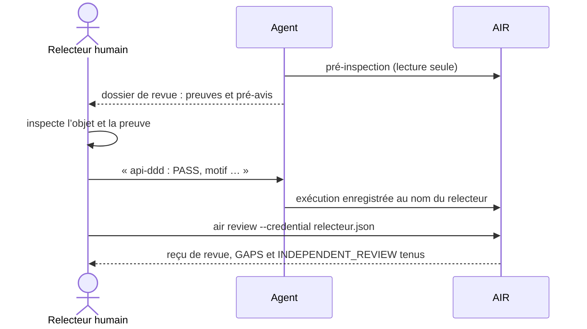

# M6 La porte « prêt à construire » et les revues humaines

**Durée** : 2 h de séance, 1 h de pratique. **Prérequis** : M3, M4.

## Objectifs

- Lire les douze critères de la porte et dire qui ferme chacun.
- Préparer une inspection avec un agent, puis l’attester soi-même.
- Faire une revue indépendante authentifiée qui approuve aussi un écart accepté.

## Déroulé

| Minutes | Activité |
| --- | --- |
| 0 à 10 | Rappel M3 et M4 |
| 10 à 35 | Notions : critères, cas de conception, preuve, relecteur non auteur |
| 35 à 55 | Démonstration : la pré-inspection du pilote et les deux défauts qu’elle a trouvés |
| 55 à 105 | Exercices 6.1 à 6.3 |
| 105 à 120 | Bilan et quiz |

## Notions

!Porte du pilote (document historique ou livrable local non inclus)

AIR refuse la revue d’un auteur : l’identité qui relit ne doit avoir écrit aucun objet de la baseline. Un agent
prépare et pré-inspecte ; il n’atteste pas à votre place.

## Exercices

### 6.1 Lire la porte

- **Piste A, Claude Code.** `/air-prouver sav`
- **Piste B.** `air readiness readiness.json` et lister pour chaque critère non tenu son `to_close` et son `owner`.

### 6.2 Préparer puis attester une inspection

- **Piste A.** « Pré-inspecte le cas de conception du SAV contre le modèle, sans rien enregistrer. » Relire la
  preuve, puis donner votre verdict à l’agent, qui enregistre l’exécution à votre nom.
- **Piste B.** Écrire le brouillon `air.VerificationRun` (méthode et niveau du cas, exécutant : vous), puis le cycle M2.

### 6.3 Faire la revue indépendante

Créer votre identité et votre droit de revue :

~~~sh
air --home .air token-create --subject <votre-nom> --role editor --name <votre-nom>.json
air --home .air policy-set politique.json      # ajouter "review": ["asteria.sav"] pour <votre-nom>
~~~

Puis `air review --credential <votre-nom>.json revue.json` avec la baseline exacte, votre verdict, votre motif et
une preuve citée.

Attendu : INDEPENDENT_REVIEW tenu ; un écart accepté par décision est approuvé par la même revue.

## Quiz

1. Pourquoi l’identité de l’agent ne peut-elle pas faire la revue ?
2. Une simulation PASS sur modèle déclaré ferme-t-elle un cas de simulation ?
3. Que faire d’un cas de conception dont l’oracle décrit le système construit ?

**Réponses.** 1 : elle a écrit des objets de la baseline ; AIR refuse la revue d’un auteur. 2 : non, il faut une
calibration sur des mesures. 3 : le scinder en une revue de conception maintenant et un test planifié dans
l’acceptation d’une unité.
