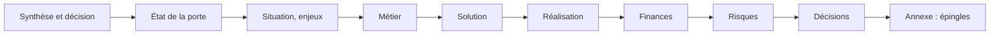

# M7 Livrer et présenter

**Durée** : 2 h de séance, 1 h de pratique. **Prérequis** : M5, M6.

## Objectifs

- Produire le dossier de livrables et les descriptions OpenAPI.
- Compiler le deck de direction bilingue, choisir l’auditoire, le critiquer.
- Présenter en comité avec la réponse d’abord et des titres d’action.

## Déroulé

| Minutes | Activité |
| --- | --- |
| 0 à 10 | Rappel M5 et M6 |
| 10 à 35 | Notions : pyramide de Minto, SCQA, titres d’action, test des titres, honnêteté des titres |
| 35 à 55 | Démonstration : les trois critiques de ChatGPT sur le deck du pilote |
| 55 à 105 | Exercices 7.1 à 7.3 |
| 105 à 120 | Bilan et quiz |

## Notions

!Synthèse de direction (document historique ou livrable local non inclus)

Un titre d’action affirme une conclusion chiffrée. Il dit « date cible » tant que les estimations sont à calibrer,
« affecté » pour une correspondance prévue, « passe la marche de conception » plutôt que « conforme ».

## Exercices

### 7.1 Produire les livrables

- **Piste A, Claude Code.** `/air-livrer sav`
- **Piste A, ChatGPT.** « Liste les livrables du SAV avec leurs empreintes, puis lis la matrice de conformité. »
- **Piste B.** `air deliverables livrables.json --workspace docs --apply`

### 7.2 Compiler et critiquer le deck

- **Piste A.** `/air-presenter sav`, audience STEERING : relire le plan (titres et sources), puis demander la critique
  en trois niveaux du skill `air-presentation`.
- **Piste B.** `air presentation deck.json --output deck.html` avec `{"title": …, "title_en": …, "baselines": […], "audience": "STEERING"}`.

Ouvrir `deck.html`, passer en anglais avec le sélecteur (ou la touche `l`), afficher les notes (`n`).

### 7.3 Test des titres

Lire seulement les titres, dans l’ordre. Chaque titre prouve-t-il la décision demandée ? Corriger le modèle, pas le
deck, quand un titre est faux.

## Quiz

1. Pourquoi l’outil MCP ne rend-il que le plan du deck par défaut ?
2. Que faire si un titre annonce une conclusion que vous savez fausse ?
3. Quelle variante d’auditoire pour une signature de contrat ?

**Réponses.** 1 : le HTML est pour les personnes ; l’agent travaille sur les titres et les sources. 2 : corriger le
modèle ou ses hypothèses, puis recompiler ; le deck ne se retouche pas à la main. 3 : CONTRACT (21 diapositives).
