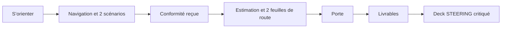

# M8 Atelier final : un dossier de bout en bout

**Durée** : 2 h. **Prérequis** : M1 à M7.

## Sujet

Le domaine **atelier** d’Asteria (maintenance connectée) doit passer en comité. En deux heures, sur la piste de votre
choix, menez le dossier jusqu’au deck de direction.

## Déroulé

| Minutes | Activité |
| --- | --- |
| 0 à 10 | Lecture du sujet, choix de la piste |
| 10 à 90 | Réalisation |
| 90 à 110 | Présentation de cinq minutes par apprenant, sur le deck compilé |
| 110 à 120 | Retours et validation |

## Grille d’évaluation

| Critère | Attendu | Points |
| --- | --- | --- |
| Changements | Validés à blanc, préparés, montrés avant dépôt | 3 |
| Scénarios | Rejoués, couverture lue, impasses expliquées | 3 |
| Conformité | Sujets du socle reliés, portée et responsables nommés | 3 |
| Estimation et feuilles de route | Écart face à la référence sans IA, recommandation justifiée | 3 |
| Porte | Critères non tenus nommés avec qui les ferme | 3 |
| Deck | Test des titres passé, critique en trois niveaux | 3 |
| Honnêteté | Aucun critère non tenu présenté comme tenu, aucune revue d’agent présentée comme humaine | éliminatoire |

Validation à 12 points sur 18, sans faute éliminatoire.
