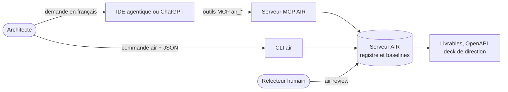
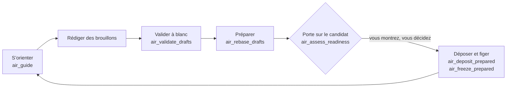
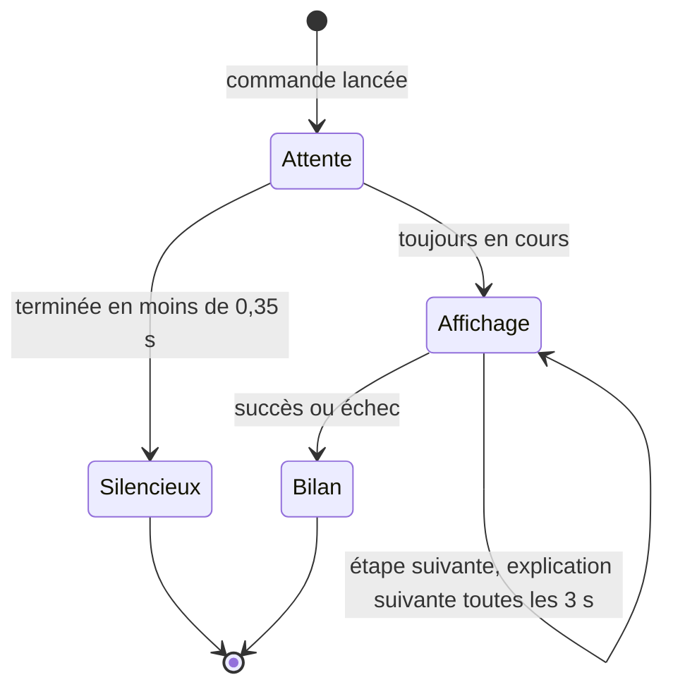
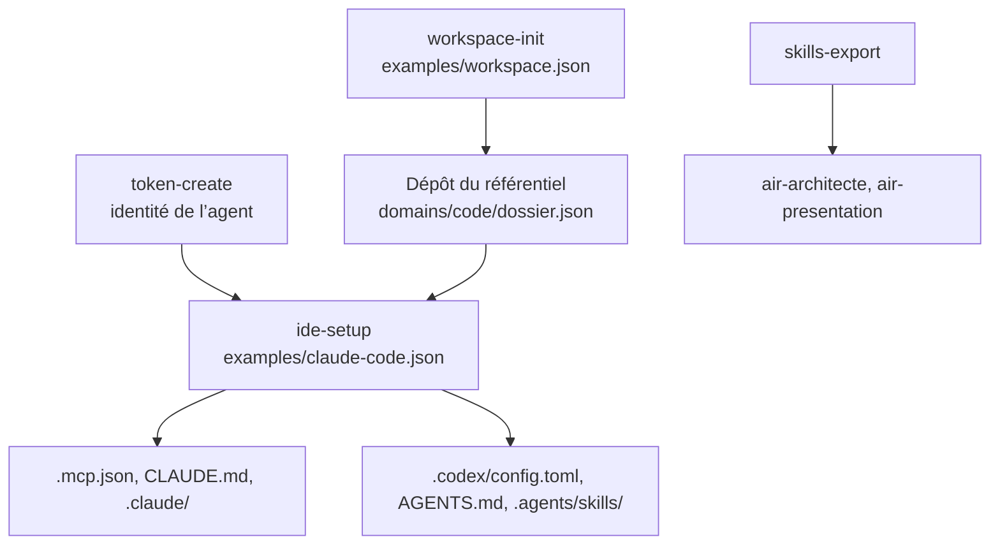
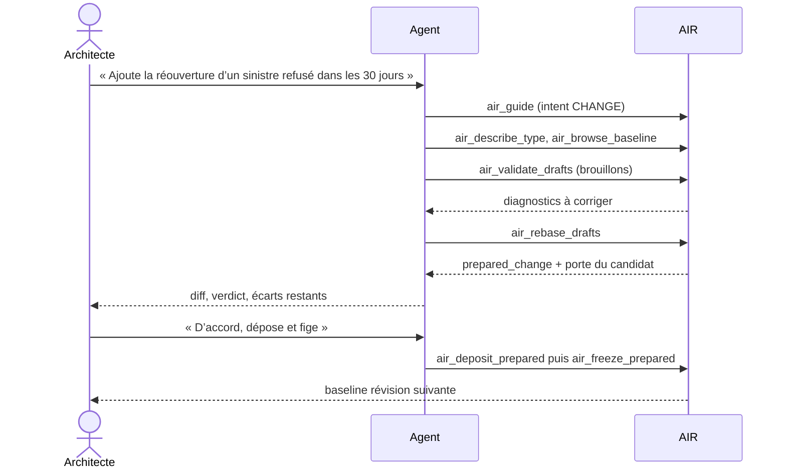
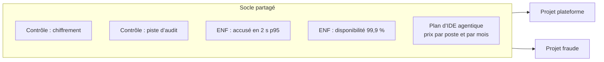
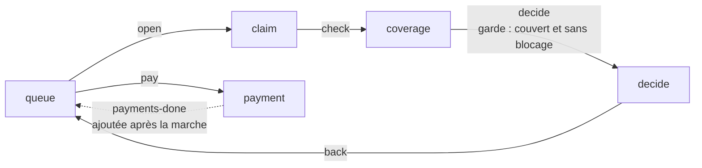
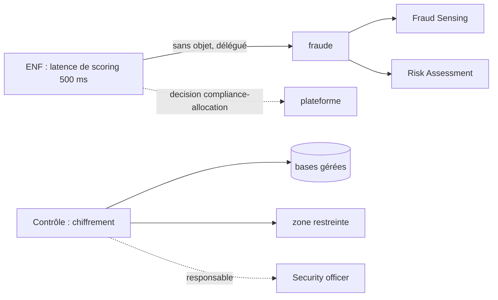
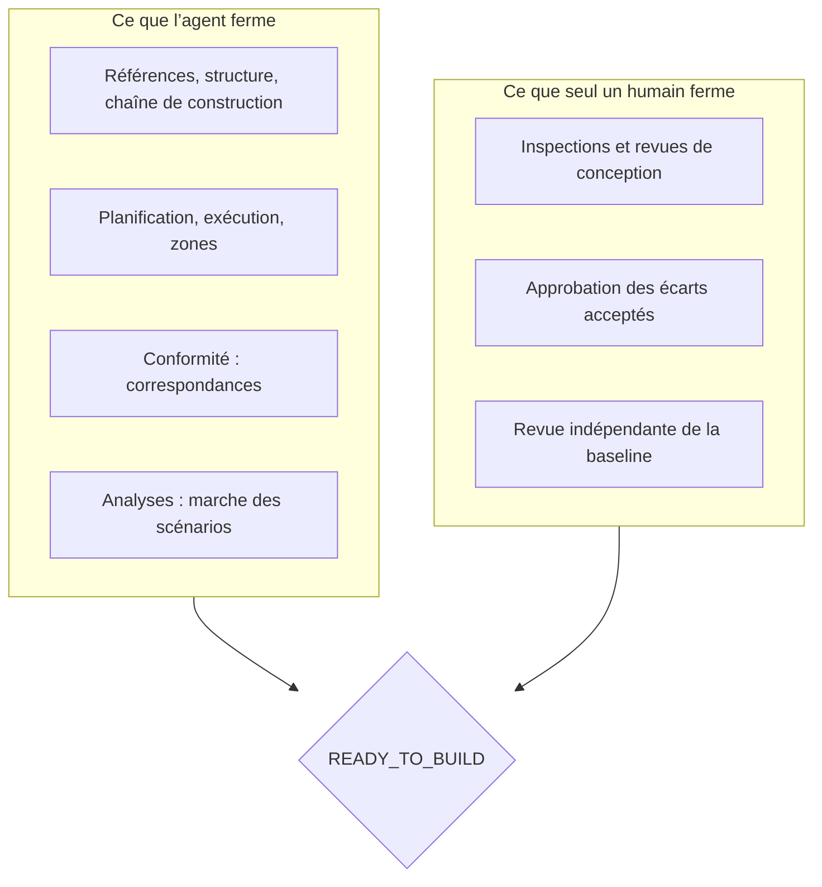

# Guide de l’architecte de solution : AIR pas à pas

Ce guide mène un architecte de solution de l’installation d’AIR jusqu’à la présentation de son architecture en comité,
en passant par la preuve qu’elle est prête à construire. Chaque étape se fait de deux façons :

- **avec un IDE agentique** (Claude Code, Codex, Cursor, OpenCode, Antigravity) ou **ChatGPT** : vous demandez en
  français, l’agent appelle les outils AIR ;
- **sans agent** : vous lancez vous-même la commande `air` avec un fichier de requête JSON.

Les deux chemins écrivent dans le même registre et donnent les mêmes résultats. Les exemples viennent du pilote
« assurance santé » (plateforme, anti-fraude et socle partagé), joué avec ChatGPT et Claude.

Pour s’exercer à son rythme, voir le [parcours de formation](../formation/README.md).

## Sommaire

1. [Comprendre la façon de travailler](#1-comprendre-la-façon-de-travailler)
2. [Installer AIR](#2-installer-air)
3. [Créer le référentiel et brancher votre agent](#3-créer-le-référentiel-et-brancher-votre-agent)
4. [S’orienter : où en est le dossier ?](#4-sorienter--où-en-est-le-dossier-)
5. [Modifier le modèle par un changement préparé](#5-modifier-le-modèle-par-un-changement-préparé)
6. [Recevoir les contrôles et exigences non fonctionnelles](#6-recevoir-les-contrôles-et-exigences-non-fonctionnelles)
7. [Écrire et rejouer les scénarios d’acceptation](#7-écrire-et-rejouer-les-scénarios-dacceptation)
8. [Relier chaque exigence à ce qui l’implémente](#8-relier-chaque-exigence-à-ce-qui-limplémente)
9. [Estimer avec et sans IA, comparer les feuilles de route](#9-estimer-avec-et-sans-ia-comparer-les-feuilles-de-route)
10. [Passer la porte « prêt à construire »](#10-passer-la-porte--prêt-à-construire-)
11. [Livrer le dossier à l’équipe de réalisation](#11-livrer-le-dossier-à-léquipe-de-réalisation)
12. [Présenter en comité](#12-présenter-en-comité)
13. [Aide-mémoire](#13-aide-mémoire)

## 1. Comprendre la façon de travailler

AIR est un registre d’architecture : chaque objet (exigence, bloc, contrat, écran, coût, risque…) a un identifiant,
des révisions et des références exactes vers les autres. Une **baseline** fige un ensemble de révisions : c’est elle
que l’on relit, que l’on juge prête à construire et que l’on livre.

Le travail suit toujours la même boucle. Rien n’est écrit sans votre accord explicite : l’agent valide à blanc,
prépare, vous montre, puis dépose et fige seulement si vous le demandez.

Ce qui reste toujours humain : les inspections et revues de conception, la revue indépendante d’une baseline,
l’approbation d’un écart accepté, et tout engagement (admission, activation, signature).

## 2. Installer AIR

| Avec un agent | Sans agent |
| --- | --- |
| Ouvrir le dépôt AIR dans l’IDE et demander : « Installe et démarre AIR ». Le skill `air-install` suit la procédure. | Suivre les commandes ci-dessous. |

~~~sh
python scripts/install.py --start
.venv/Scripts/python.exe -m air doctor          # Unix : .venv/bin/python
~~~

`doctor` doit répondre `status: ok`. Le service écoute sur `http://127.0.0.1:8740`. Pour une installation depuis la
roue Python (poste d’architecte sans le code source), voir [distribution](../distribution.md).

### Pendant une commande longue

Quand une commande dure plus d’un tiers de seconde (compiler les livrables, le deck, juger la porte, rejouer les
scénarios, préparer un changement), la CLI affiche dans le terminal ce qu’elle va faire, l’étape en cours, ce
qu’AIR y fait, et le temps écoulé :

~~~text
⣷⣿⣶⣀⠀⡀ AIR  Compiler le dossier de livrables  4,3 s
  ✔ Lire la requête  0,0 s
  ⠹ AIR compile 37 documents et le deck de direction  4,3 s
    ↳ calcul de la porte prêt à construire de chaque baseline
  ○ Comparer et écrire les fichiers
~~~

À la fin, une seule ligne reste : `✔ AIR  Compiler le dossier de livrables  terminé en 4,6 s`, suivie de ce qui a
été produit (fichiers écrits, verdict de la porte, scénarios PASS et FAIL, révision figée).

L’affichage s’écrit sur la sortie d’erreur et seulement dans un terminal interactif : le JSON de la sortie standard
reste intact pour les scripts et les agents. Il se tait avec `--quiet`, `AIR_NO_SPINNER=1`, sous CI, ou quand la
sortie d’erreur est redirigée. `NO_COLOR` retire les couleurs ; un terminal sans Unicode reçoit des caractères
ASCII. La langue suit `AIR_LANG` (`fr` ou `en`), sinon celle du système. Pour le voir sans serveur :
`python -m air.tui`.

## 3. Créer le référentiel et brancher votre agent

Un référentiel est un dépôt Git par domaine ou par projet. `workspace-init` le crée, `ide-setup` y écrit la
configuration de l’agent : serveur MCP, permissions, skills et parcours guidés.

~~~sh
air --home .air token-create --subject claude-code-agent --role editor --name claude-code.json
air workspace-init examples/workspace.json --workspace ../referentiel --apply
air ide-setup examples/claude-code.json --workspace ../referentiel --apply
~~~

Adapter d’abord les chemins, les domaines et le nom de l’identifiant dans les deux requêtes. `ide-setup` produit
pour Claude Code des commandes que vous tapez directement :

| Commande | Ce qu’elle fait |
| --- | --- |
| `/air-dossier` | État exact d’un domaine et verdict prêt à construire |
| `/air-proposer` | Changement validé à blanc, préparé, montré, puis déposé sur accord |
| `/air-relire` | Relecture MECE et DDD d’une révision |
| `/air-prouver` | Ce qui est prouvé et ce qui ne l’est pas (porte, simulations) |
| `/air-accepter` | Scénarios rejoués, non-régression, conformité |
| `/air-impact` | Effet d’un changement d’un autre projet |
| `/air-livrer` | Livrables et OpenAPI |
| `/air-presenter` | Deck de direction bilingue |

**ChatGPT.** AIR s’y branche par le tunnel MCP sécurisé d’OpenAI : voir [intégrations IDE](../integrations-ide.md)
et [guide de l’agent](../guide-architecte-agent.md). Après chaque mise à jour d’AIR : redémarrer le processus MCP du
tunnel, puis Réglages, Plugins, AIR, **Refresh**.

**Skills portables** pour tout agent :

~~~sh
air skills-export --target ../referentiel --layout agents --apply    # Codex, Cursor, Antigravity, OpenCode
air skills-export --target ../referentiel --layout claude --apply    # Claude Code
air skills-export --target ./zips --layout chatgpt --apply           # à téléverser dans ChatGPT ou Claude.ai
~~~

## 4. S’orienter : où en est le dossier ?

| Avec un agent | Sans agent |
| --- | --- |
| « Où en est le dossier fraude ? Est-il prêt à construire ? » (Claude Code : `/air-dossier fraude`) | `air guide guide.json` avec `{"baseline": {"id": "urn:…:baseline"}, "intent": "ORIENT"}` |

La réponse d’`air_guide` porte le verdict de la porte (`readiness`), la santé du modèle, les emprunts en retard et,
pour un dossier de solution, un bloc `delivery` : scénarios, conformité, estimation, feuilles de route. Les
`next_steps` donnent les appels exacts suivants.

> **Exemple réel, ChatGPT (pilote, passe 7).** Question posée : « Avec AIR, prépare le passage en comité de pilotage
> du programme santé (plateforme et fraude, avec le socle partagé)… Ne modifie rien dans AIR. » ChatGPT a appelé
> `air_guide` sur chaque projet, lu les livrables 32 à 37 par empreintes, rejoué les scénarios et compilé le plan
> du deck : 10 appels, 322 Ko, sans erreur, en 3 min 16 s. Réponse : 12 scénarios sur 12 passent, 19 exigences sur
> 19 affectées, gain d’effort prévu de 36 %, une feuille de route recommandée par projet.

## 5. Modifier le modèle par un changement préparé

Un changement est un lot de brouillons : de nouveaux objets en révision 1, ou la révision suivante d’objets
existants. AIR fait avancer seul les références des objets qui en dépendent.

> **Exemple réel, Claude Code (pilote, passe 4).** Dans le dépôt de la plateforme, l’architecte demande de
> rouvrir un sinistre refusé dans les 30 jours, puis de déposer et figer. L’agent a produit 16 changements de
> contenu ; AIR a fait avancer 36 références ; la plateforme r5 a été figée avec une description OpenAPI à
> 8 opérations. Aucun script, aucune cascade de révisions à la main.

Sans agent, les mêmes étapes :

~~~sh
air drafts-validate validate.json      # {"objects": [...], "base": {baseline exacte}, "profile": "air.delivery/0.32"}
air drafts-rebase rebase.json          # mêmes champs ; rend prepared_change.id
air readiness candidat.json            # {"prepared_change": "urn:air:prepared-change:…"}
air prepared-deposit depot.json        # {"prepared_change": "…"}
air prepared-freeze gel.json           # {"prepared_change": "…", "name": "…", "description": "…"}
~~~

`air type-describe` donne le schéma exact de chaque type ; `air baseline-browse` lit une baseline page par page.

## 6. Recevoir les contrôles et exigences non fonctionnelles

Les contrôles de conformité (`Control`) et les exigences non fonctionnelles (`QualityRequirement`) se déclarent
une fois, dans le **socle partagé**. Chaque projet qui emprunte le socle les reçoit en entrée, même s’il ne les cite
pas : la porte lui demandera de les relier (étape 8).

| Avec un agent | Sans agent |
| --- | --- |
| « Ajoute au socle un contrôle de chiffrement vérifié par inspection et l’exigence d’accusé de réception en 2 s au 95e centile. » | Brouillons `air.Control`, `air.VerificationCase`, `air.QualityRequirement`, puis le cycle de l’étape 5 |

Les formes exactes sont dans le skill [`air-architecte`](../../src/air/skills/air-architecte/references/modelling.md).

## 7. Écrire et rejouer les scénarios d’acceptation

Un scénario d’acceptation joue un objectif de persona sur une carte de navigation : écran, action, transition,
opération du contrat, résultat attendu. `air_walk_scenarios` le rejoue **sur la conception**, avant toute ligne de code.

Sur le pilote, la marche a trouvé deux défauts avant construction : une page de paiement sans issue (la transition
en pointillé manquait) et un dialogue d’explication sans retour.

| Avec un agent | Sans agent |
| --- | --- |
| « Rejoue les scénarios de la plateforme et dis-moi ce qui n’est pas couvert. » (Claude Code : `/air-accepter platform`) | `air scenarios-walk walk.json` avec `{"baseline": {…}}` |

!Diapositive « interfaces et scénarios » (document historique ou livrable local non inclus)

Chaque scénario lié à un cas de conception produit un brouillon d’exécution (méthode ANALYSIS) : l’ajouter par le
cycle de l’étape 5 conserve le résultat déclaré, sans le compter comme vérifié. Pour qualifier l'avis de
conception, un relecteur indépendant examine le cas exact et dépose une revue avec `proof_assessments`,
après préparation d'un rapport conforme au [contrat P03](../lot-qualification-preuves.md). Le rapport du
parcours d'acceptation, à lui seul, ne remplace pas cet avis. Les scénarios de la suite `REGRESSION` forment le socle de
non-régression (livrable 33) ; leurs cas `TEST` s’exécutent après construction. L’adaptateur
[Python unittest signé](../lot-preuves-externes.md) permet de qualifier une telle exécution : suite
autorisée, challenge exact, import du rapport puis revue indépendante `EXECUTED_TEST`. La signature
et la revue restent liées au mandat, à l’environnement et à leur fenêtre de validité.

## 8. Relier chaque exigence à ce qui l’implémente

Pour chaque contrôle et chaque exigence reçus, le projet déclare un `ComplianceMapping` :

- **implémenté par** des blocs ou unités (portée métier), ou des composants, équipements, connexions, zones
  (portée technique, qui demande alors un rôle responsable `accountable`) ;
- ou **sans objet** chez lui, avec la décision qui le dit et le projet qui l’implémente (`delegated_to`).

| Avec un agent | Sans agent |
| --- | --- |
| « Quels contrôles du socle ne sont pas encore reliés dans le projet fraude ? Propose les correspondances. » | `air readiness readiness.json` : le critère COMPLIANCE liste les sujets non reliés |

La matrice complète, projet par projet, est le livrable 34.

## 9. Estimer avec et sans IA, comparer les feuilles de route

Par unité de construction, un `DeliveryEstimate` répartit l’effort par activité, sans IA et avec IA là où elle
s’applique (la revue humaine et le durcissement de sécurité restent entiers). AIR calcule l’écart, la durée et le
coût d’abonnement de l’outillage agentique.

!Effort sans et avec IA par unité (document historique ou livrable local non inclus)

Chaque projet compare deux ou trois `Roadmap` (par exemple séquentielle sans IA, MVP d’abord avec IA, parallèle
avec IA). Une phase qui attend un autre projet le déclare (`external_depends_on`) : AIR refuse les dates
incompatibles et trace le chemin critique du programme à travers les projets.

!Comparaison des feuilles de route (document historique ou livrable local non inclus)

!Gantt du programme et dépendances entre projets (document historique ou livrable local non inclus)

Sur le pilote, déclarer ces dépendances a révélé sept conflits : les trois feuilles de route de la fraude
commençaient avant les phases de la plateforme dont elles dépendent. Elles ont été recalées sans changer la date
de fin du programme.

## 10. Passer la porte « prêt à construire »

`air_assess_readiness` juge une baseline exacte (ou un changement préparé) sur douze critères, chacun avec ce qui
le ferme et à qui cela revient.

!Porte prêt à construire sur les trois baselines du pilote (document historique ou livrable local non inclus)

Pour les gestes humains, AIR exige un relecteur **qui n’a écrit aucun objet** de la baseline : créez une identité
à votre nom (`token-create`), donnez-lui le droit `review` (`policy-set`), puis :

~~~sh
air review --credential <votre-nom>.json revue-plateforme.request.json
~~~

La requête épingle la baseline exacte, votre verdict (`ACCEPTED` ou `REJECTED`), votre motif et une preuve citée.
Sur le pilote, un dossier de revue préparé par l’agent pré-inspecte chaque cas ouvert contre le modèle ; il a
trouvé deux défauts réels (enregistrement d’audit absent des commandes de la fraude, réponses d’erreur manquantes
sur deux API), corrigés avant la revue humaine.

## 11. Livrer le dossier à l’équipe de réalisation

| Avec un agent | Sans agent |
| --- | --- |
| « Produis les livrables du programme » (Claude Code : `/air-livrer`) : l’agent lit les empreintes puis les documents utiles | `air deliverables livrables.json --workspace docs --apply` |

Le dossier compte 37 documents Markdown avec diagrammes (chaîne de valeur, parcours, séquences, états,
modèles de données, infrastructure, zones, ADR, risques, CAPEX et OPEX, scénarios, non-régression, matrice de
conformité, estimation IA, feuilles de route) et la présentation de direction. Chaque document cite ses objets
exacts ; une régénération remplace ses propres fichiers et garde vos modifications à la main.

~~~sh
air openapi-compile openapi.json --output claims.openapi.json   # une API
~~~

## 12. Présenter en comité

Le deck suit la structure d’un cabinet de conseil : la réponse d’abord (synthèse et décision demandée), l’état de
la porte, puis métier, solution, réalisation, finances, risques et décisions. Chaque titre est une conclusion
calculée depuis le modèle ; un sélecteur passe du français à l’anglais.

!Synthèse de direction (document historique ou livrable local non inclus)

!État de la porte par projet (document historique ou livrable local non inclus)

| Avec un agent | Sans agent |
| --- | --- |
| `/air-presenter` ou « Prépare la présentation de direction du programme pour le comité » : l’agent rend le plan (titres et sources) et le critique avec le skill `air-presentation` | `air presentation deck.json --output deck.html` avec `{"title", "title_en", "baselines", "audience", "projects"}` |

Le deck est écrit pour un dirigeant qui n’est pas architecte : titres en phrases complètes et en mots de métier,
une ligne « Ce que cela signifie » sur les diapositives qui portent une conséquence, et les projets désignés par
leur nom métier, donné dans `projects` (par exemple `{"health.fraud": {"fr": "Lutte contre la fraude", "en": "Fraud
prevention"}}`).

`audience` choisit la longueur : `SPONSOR` (10 diapositives), `STEERING` (16), `CONTRACT` (21). Touches : flèches
pour naviguer, `n` pour les notes, `l` pour la langue ; impression en PDF au format 16:9.

!CAPEX et OPEX (document historique ou livrable local non inclus)

> **Exemple réel, ChatGPT (passe 7).** ChatGPT a critiqué trois versions du deck. Ses remarques ont changé AIR :
> « date cible » au lieu de « livrable le », « affecté » au lieu de « implémenté », gain de l’IA présenté comme une
> prévision à calibrer, porte juste après la synthèse. Sa dernière critique ne portait plus que sur l’ordre des
> diapositives.

## 13. Aide-mémoire

| Besoin | Outil de l’agent | Commande CLI |
| --- | --- | --- |
| Où en est le dossier | `air_guide` | `air guide` |
| Dernières révisions | `air_list_revisions` | `air revisions` |
| Lire une baseline | `air_browse_baseline` | `air baseline-browse` |
| Schéma d’un type | `air_describe_type` | `air type-describe` |
| Valider à blanc | `air_validate_drafts` | `air drafts-validate` |
| Préparer | `air_rebase_drafts` | `air drafts-rebase` |
| Déposer, figer | `air_deposit_prepared`, `air_freeze_prepared` | `air prepared-deposit`, `air prepared-freeze` |
| Porte prêt à construire | `air_assess_readiness` | `air readiness` |
| Rejouer les scénarios | `air_walk_scenarios` | `air scenarios-walk` |
| Simuler un scénario de performance | `air_simulate_scenario` | `air scenario-simulate` |
| Livrables | `air_compile_deliverables` | `air deliverables` |
| API | `air_compile_openapi` | `air openapi-compile` |
| Deck de direction | `air_compile_presentation` | `air presentation` |
| Revue humaine | (non publié à un agent) | `air review` |

**Pièges à connaître**

- Une simulation donne un résultat conditionnel sur un modèle. La calibration vérifie un accord numérique
  avec des observations de durée ; elle ne suffit pas à établir une preuve authentifiée de comportement.
- `construction_ready` ne veut pas dire prêt à construire : lire `readiness`.
- Un agent ne remplace pas un relecteur : AIR refuse la revue d’un auteur.
- Après une mise à jour d’AIR, rafraîchir le catalogue d’outils du client (ChatGPT : Refresh du plugin).
