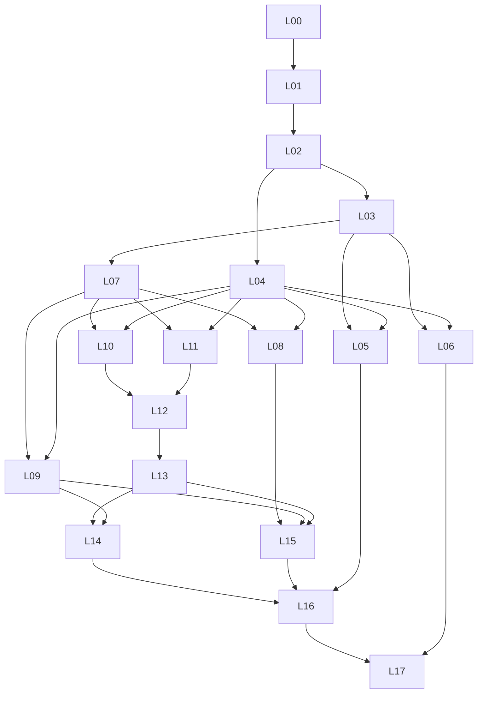

# Lots de développement AIR

Statut : L00/L01/L02/L03/L04/L05/L06/L07/L08/L09/L10/L11/L12/L13/L14/L15/L16/L17 IN_PROGRESS, autres PLANNED ; aucun lot complètement réceptionné. Voir [état de réalisation](etat-implementation.md). Charges estimatives avant réserve ; une SP vaut cinq jours-personnes. Les dépendances ci-dessous sont les conditions de réception finale. Les contrats, maquettes et tests peuvent être préparés avant livraison complète des dépendances. La sécurité et la documentation sont réalisées dans chaque lot.

Chaque sous-travail porte un identifiant stable Lxx.n, directement utilisable pour créer une issue. Une issue d’implémentation devra ajouter baseline, entrées, sorties, fichiers, responsable, critères de réception, dépendances, permissions et preuves attendues. Les sous-travaux commencés sont marqués IN_PROGRESS dans backlog.json ; leur réception complète reste à faire.

## L00 - Spécification exécutable et cadrage

**4–6 SP ; dépendance : aucune ; responsable : produit et langage.** Sources : §§2–5, 18, annexes A–F.

- L00.1 : transformer l’inventaire des 143 types, 84 règles et 18 opérations en registre de spécification ; séparer normatif, illustratif et choix d’implémentation.
- L00.2 : résoudre records manquants, enums, relations implicites, fermeture de baseline, transitions, erreurs et profils de conformité ; documenter les ADR.
- L00.3 : définir frontière du produit, modèle de licence à instruire, support, politique de version et extension ; fixer volumes de référence et objectifs de service.
- L00.4 : conserver le cas Claims de référence du white paper et préparer trois dossiers Asteria Industrie (SAV, atelier connecté, identités) ; fixer mandats, cas interdits, oracles et responsabilités du pilote. Voir demonstration-trois-dossiers.md.

**Réception :** chaque élément possède page source, lot propriétaire et méthode de vérification ; aucune ambiguïté bloquante pour L01/L02 ne reste implicite. Les décisions non résolues portent responsable et échéance. Ce lot produit une spécification, pas une conformité logicielle.

## L01 - Noyau sémantique et temporel

**8–12 SP ; dépendance : L00 ; responsable : noyau.** Sources : §5, A.1–A.2, B.1, D.2.

- L01.1 : registre de types, enveloppe meta/body, records stricts, schémas JSON et modèles de code générés depuis une seule définition.
- L01.2 : parseurs JSON/YAML sûrs, formats activés, Decimal/Money/Quantity, dates UTC et intervalles [début, fin).
- L01.3 : références exactes, normalisation des ensembles, relations matérialisées sans doublon, identité stable et révisions immuables.
- L01.4 : baselines fermées, vecteurs de versions, reconstruction bitemporelle, canonicalisation et digests externes aux objets.

**Réception :** deux sérialisations équivalentes produisent le même digest après normalisation ; clés dupliquées et références incompatibles sont refusées ; correction rétroactive et requête « connu à telle date » conservent l’ancien état. Les types sont complétés fonctionnellement par les lots métier.

## L02 - AIR-Expr, validation et portes

**10–16 SP ; dépendance : L01 ; responsable : noyau et assurance.** Sources : §6, §8.3, annexe C, D.4.

- L02.1 : AST typé, opérateurs purs, unités, quantification finie, budget d’évaluation, limites de taille et profondeur.
- L02.2 : résultats SATISFIED/VIOLATED/UNKNOWN/CONFLICTING et applicabilité distincte ; erreurs de calcul conservées comme diagnostics.
- L02.3 : moteur de règles versionnées, portée et couverture, contrôles non exécutés et revues manuelles visibles.
- L02.4 : décisions de portes distinctes des résultats ; dérogation limitée et vérifiée ; contrat de plugin de règle et fixtures.

**Réception :** division par zéro, donnée manquante, contradiction et épuisement de budget ne passent jamais pour une satisfaction. Faux ET inconnu et vrai OU inconnu suivent D.4. Une règle non exécutée et une revue sans preuve empêchent le passage prévu. Les lots métier ajoutent ensuite les prédicats de leur domaine.

## L03 - Workspace, CLI, baselines et CI

**6–10 SP ; dépendances : L01, L02 ; responsable : Developer Experience.** Sources : D.1, D.9, §18.7.

- L03.1 : template solution-air, manifeste, lockfile, arborescence, exclusion des secrets et exemples complets.
- L03.2 : commandes init, resolve, validate, diff, impact, view ; sortie humaine et JSON, erreurs stables et codes de sortie documentés.
- L03.3 : sauvegarde d’un ChangeSet, comparaison de baselines, migrations explicites, lecture seule des sorties générées.
- L03.4 : CLI installable sur Windows/macOS/Linux et chaîne CI portable avec un adaptateur initial ; tests hors réseau.

**Réception :** deux postes propres reconstruisent la même baseline et le même rapport. Un import flottant ne passe pas une publication fermée. Réexécuter init ne détruit pas le travail ; la CI ne crée aucune admission. Les commandes non livrées sont clairement indisponibles.

## L04 - Identité, autorisations, API, jobs et audit

**10–16 SP ; dépendances : L01, L02 ; responsable : backend et sécurité.** Sources : §15, §18.3–18.6, D.5–D.7.

- L04.1 : jetons locaux générés au bootstrap, expiration/révocation et rôles ; OIDC optionnel indépendant du backend ; identités de service, mandat délégué, isolation entreprise/domaine et contrôle d’accès par objet/aspect.
- L04.2 : services applicatifs communs aux bindings, schémas d’erreur, idempotence, pagination stable et budgets de requêtes.
- L04.3 : approbation liée au digest, auteur authentifié, portée, expiration et version de politique ; aucune approbation auto-déclarée par le client.
- L04.4 : jobs durables, annulation, reprise, journal filtré, outbox et audit ; stockage d’artefacts avec autorisation effective.

**Réception :** accès inter-locataire refusé dans lecture, recherche, export, cache et contexte IA ; jeton révoqué et politique modifiée pris en compte ; job repris après panne sans doubler un effet. Les contrôles d’autorité sont testés avant toute fonction engageante.

## L05 - MCP, skills et adaptateurs IDE

**6–10 SP ; dépendances : L03, L04 ; responsable : Developer Experience.** Sources : §17, D.5, D.8.

- L05.1 : binding MCP local stdio et distant Streamable HTTP, découverte, schémas d’outils et mêmes contrôles que l’API.
- L05.2 : source commune d’instructions ; génération contrôlée des fichiers propres aux clients sans écraser leurs personnalisations.
- L05.3 : skills de capture, qualification, existant, décomposition, réutilisation, options, expérience, estimation, plan, impact, vue et publication préparée.
- L05.4 : recettes et matrice de compatibilité Codex/ChatGPT, Claude Code, Copilot, Gemini CLI, Antigravity et OpenCode ; versions et modes testés.

**Réception :** chaque client déclaré compatible réalise lire → proposer → valider → présenter, puis se voit refuser une opération hors mandat. Les artefacts validés sont équivalents ; les formulations générées peuvent varier. Un autre client reprend sans l’historique de conversation. Voir le protocole détaillé d’intégration.

## L06 - Connaissance et ingestion sourcée

**8–12 SP ; dépendances : L03, L04 ; responsable : connaissance et architectes.** Sources : §§4–6, A.3–A.4.

- L06.1 : import contrôlé de fichiers, documents, code et spécifications ; références de source, révision, digest, sélecteurs et politiques de rétention.
- L06.2 : extraction déterministe et extraction assistée séparées ; toute extraction IA crée une proposition attribuée.
- L06.3 : qualification d’assertion, preuve favorable ou contraire, hypothèse, inconnue, inférence, conflit et décision de revue.
- L06.4 : ContextSnapshot, couverture, fraîcheur, restrictions, recherche autorisée et invalidation des sources obsolètes.

**Réception :** citation retrouvable dans son document ; source inaccessible → inconnue visible ; contradiction conservée ; instruction hostile dans le document sans élévation de droits ; suppression d’une source signalée dans la capacité de replay. Aucun import ne transforme automatiquement une affirmation en fait établi.

## L07 - Contrats, compilation et dossiers de construction

**10–16 SP ; dépendances : L02, L03 ; responsable : noyau et ingénierie.** Sources : §§7–8, §10, A.5–A.8, A.10, A.13.

- L07.1 : fonctions, états, workflows, données et autorités, interactions humaines/physiques, UI, médias, droits et bibliothèques.
- L07.2 : SemanticContract et bindings ; compatibilité des schémas et comportements formalisés ; obligations de revue pour ce qui ne l’est pas.
- L07.3 : unités, sorties, réception, estimations, dépendances, gates, livrables de formation et fonctionnement ; dossier de construction par unité.
- L07.4 : compilateur/linker, mappings et pertes ; générateurs initiaux OpenAPI, AsyncAPI, documentation et squelette de référence.

**Réception :** SubmitClaim distingue enregistrement et décision de couverture. Une obligation perdue bloque la sortie constructible. Les générateurs ne réécrivent pas la source canonique. Un parcours relie interface, données, contrat, unité et vérification. Le squelette livré ne revendique pas la qualité d’un système de production complet.

## L08 - Workbench, vues et collaboration

**10–16 SP ; dépendances : L03, L04, L07 ; responsable : frontend et UX.** Sources : §14, A.7, A.12.

- L08.1 : navigation par objectif, parcours, contrat, unité et preuve ; comparaison de baselines et impacts qualifiés.
- L08.2 : vues direction, métier, ingénierie, construction, capacité, risque, partenaire et reprise ; exports filtrés avec mappings.
- L08.3 : questions, contestations, revues, décisions, affectations et résolution ; édition en proposition par les mêmes services.
- L08.4 : séparation layout/modèle, accessibilité, localisation et diagnostics compréhensibles pour les contributeurs non techniques.

**Réception :** déplacer un bloc à l’écran ne change pas le modèle ; une modification architecturale crée un ChangeSet. Le partenaire ne découvre aucun détail interdit. Les mêmes chiffres calculés apparaissent dans toutes les vues ; la reformulation IA ne les recalcule pas.

## L09 - Simulation, expériences et replay

**10–16 SP ; dépendances : L04, L07 ; responsable : calcul et assurance.** Sources : §§8–10, A.9, A.13.

- L09.1 : ExecutableArchitectureModel, modèles et scénarios ; machines d’états et workflows ; plugin de simulation avec contrat de fidélité.
- L09.2 : workers isolés sans effets externes par défaut ; ressources, temps, réseau, fichiers et journaux bornés.
- L09.3 : expériences, recettes, runs et résultats ; paramètres, données, graines, répétitions, incertitude et classe de preuve.
- L09.4 : replay par objet et comparateur déclaré ; sorties génératives acceptées conservées ; calibration distincte de l’évaluation.

**Réception :** Claims couvre chemin nominal, doublon, panne de source et accès interdit ; effets externes neutralisés. Le replay historique retrouve ses entrées. Un changement de moteur invalide une promesse d’identité non démontrée. Un run terminé avec succès peut conclure VIOLATED.

## L10 - Planification et capacité

**12–18 SP ; dépendances : L04, L07 ; responsable : calcul et responsables de ressources.** Sources : §§10–11, §19.3, A.10.

- L10.1 : DAG de construction, occurrences, synchronisations, calendriers, effort et durée séparés.
- L10.2 : profils, pools et identités réelles ; offre nette, obligations, demande, habilitations et supervision ; règles d’allocation des coûts.
- L10.3 : solveur sous contraintes, variantes, statut, objectif, borne, limite de temps et explication de l’infaisabilité ; choix de départage.
- L10.4 : métriques par profil/période, agents qualifiés par tâche, revue humaine réservée et intégration du changement organisationnel.

**Réception :** la fixture Claims produit 9 semaines avec backend=4 et 11 avec backend=2, sous ses hypothèses. Une personne ayant deux profils n’offre pas deux temps. Une variante exploratoire n’est pas additionnée à une autre comme engagement. Le calcul ne réserve rien. Le statut « optimal » nécessite une preuve.

## L11 - Packages, fédération et index

**10–16 SP ; dépendances : L03, L04, L07 ; responsable : backend et architecture entreprise.** Sources : §12, §18.4–18.5, D.6.

- L11.1 : registre de packages, imports/exports, signatures et révocation ; résolution exacte, lockfiles et politique de compatibilité.
- L11.2 : publication en préparation invisible puis engagement atomique du manifeste complet.
- L11.3 : contextes fédérés, contributions, empreintes, checkpoints et visibilité ; sources conservant leur autorité.
- L11.4 : projections de graphe, recherche et impact ; outbox/inbox, déduplication, ordre par agrégat, réparation et reconstruction.

**Réception :** package corrompu refusé ; crash pendant publication sans version partielle visible ; événements dupliqués ou désordonnés sans régression ; index reconstruit depuis snapshot puis replay. Perdre l’index ne perd ni décisions ni engagements.

## L12 - Réconciliation et aménagement

**8–12 SP ; dépendances : L10, L11 ; responsable : architecture entreprise et backend.** Sources : §13, A.11.

- L12.1 : détection d’incompatibilités de contrats, chevauchements de capacités et d’autorités, conflits de séquences et frontières de données.
- L12.2 : ReconciliationCase, participants, variantes et décisions ; propositions de correspondance sémantique soumises à examen.
- L12.3 : EnterprisePlacement, ReconfigurationPlan, diff, impact, transition, coûts et autorités requises.
- L12.4 : CapabilityDelta, migration de taxonomie et fenêtres de stabilité ; retour explicite vers les projets.

**Réception :** Claims/Finance proposent une mutualisation de paiement sans fusion implicite. Les sources ne sont modifiées que par un changement autorisé chez leur détenteur. Une décision ne devient RESOLVED qu’après vérification de sa mise en œuvre. Les explications respectent les restrictions de divulgation.

## L13 - Admission et engagements

**12–20 SP ; dépendances : L04, L10, L11, L12 ; responsable : backend transactionnel et sécurité.** Sources : §13.4–13.5, D.7.

- L13.1 : registre d’autorité et transitions ; verrouillage des scopes d’invariants, plages temporelles, budgets et ressources ; gestion des reprises transactionnelles.
- L13.2 : vérification du plan exact, politiques, versions, mandats et approbations ; reçus, réservations et événements dans une même transaction.
- L13.3 : idempotence concurrente, digest de demande, résultats perdus après commit, refus métier et erreurs transitoires distingués.
- L13.4 : coordination durable multi-autorités, HELD avec expiration, confirmations, compensation et quotas délégués non chevauchants.

**Réception :** deux demandes concurrentes dépassant ensemble l’offre ne sont jamais toutes deux admises. Même clé/même contenu retrouve le même résultat ; contenu différent refusé. Panne après commit, préparation expirée et échec partiel sont récupérés sans engagement fantôme. Le reçu reste PREPARING tant qu’une confirmation manque.

## L14 - Revalidation et activation temporelle

**8–14 SP ; dépendances : L09, L10, L13 ; responsable : calcul et backend transactionnel.** Sources : §§11.5–11.8 et annexe F.

- L14.1 : cinq types d’extension, records et états d’épisode ; avancement reçu, travail en cours protégé et demande restante.
- L14.2 : actualisation de l’offre et qualification potentielle/annoncée/qualifiée/engagée ; déduplication des ressources entre fournisseurs.
- L14.3 : graphe de mobilisation, calendriers, marges, expirations et événements ; comparaison P0, P0-décalé et P1.
- L14.4 : reassess, prepare et authorize ; reprise, activation partielle indépendante et contrôle atomique ou coordonné des conditions au lancement.

**Réception :** F.7 retrouve 8 ingénieur-semaines et 4 analyste-semaines manquantes, puis 4 et 4 avec les deux ingénieurs disponibles à partir de la troisième semaine. Source critique indisponible → UNKNOWN bloquant. Recalcul sans réservation/libération/commande. Condition perdue juste avant lancement → refus ; aucun arrêt brutal implicite du travail déjà exécuté.

## L15 - Exploitation, dérives et actifs durables

**8–12 SP ; dépendances : L08, L09, L11, L13 ; responsable : observabilité et responsables d’actifs.** Sources : §16, A.12.

- L15.1 : artefacts, déploiements, configuration, runtime et baseline reliés ; import de signaux avec couverture et fenêtre.
- L15.2 : drift attendu/observé, dépendances affectées, contribution et décision de traitement ; aucune réécriture automatique de l’histoire.
- L15.3 : calibration sur données distinctes d’évaluation, mesures prévision/réel et coût de supervision.
- L15.4 : transfert projet → SolutionAsset, maintenance des bibliothèques, retrait, consommateurs et preuves conservées selon politique.

**Réception :** une observation sur la charge humaine Claims rouvre la bonne hypothèse et indique les décisions touchées, en préservant leur baseline. Absence de trace ne prouve pas absence de dépendance. Le retrait vérifie engagements et consommateurs. Le nouveau responsable accepte explicitement le transfert.

## L16 - Distribution entreprise et connecteurs

**12–18 SP ; dépendances finales : L04, L05, L11, L13, L14, L15 ; responsable : plateforme et intégrations.** Démarrage de la préparation dès L00 ; premières distributions dès I1.

- L16.1 : installateur Python idempotent, SQLite et fichiers locaux, authentification locale et skill portable dès la première tranche ; paquets CLI puis OCI/Kubernetes optionnels ; configuration validée et diagnostic.
- L16.2 : PostgreSQL et OIDC optionnels indépendants ; stockage d’objets et coffre d’entreprise optionnels ; proxy/PKI, observabilité et distributions hors ligne.
- L16.3 : SDK de connecteur et adaptateurs de référence pour Git, fichiers/spécifications, source capacitaire et télémétrie ; mapping et provenance.
- L16.4 : sauvegarde/restauration SQLite et PostgreSQL, migrations de schéma et transfert vérifié SQLite → PostgreSQL, rollback/compensation, SBOM, signatures, export complet, réversibilité et support.

**Réception :** un IDE suivant docs et SKILL.md installe SQLite/local en une commande ; un administrateur extérieur teste les options PostgreSQL/OIDC indépendamment, migre les données et restaure une sauvegarde contenant de vrais engagements de test. Le mode hors ligne s’installe sans téléchargement caché. Un nouveau connecteur utilise le SDK sans modifier le noyau. Aucun déploiement SaaS partagé n’est imposé.

## L17 - Qualification, pilotes et transfert

**10–16 SP ; réception après L00–L16 ; responsable : assurance et produit, avec entreprises pilotes.** Les fixtures, l’automatisation et la formation sont préparées dès le départ.

- L17.1 : suite des 84 règles, 143 types, relations, états et 18 opérations ; traçabilité entre exigences et résultats.
- L17.2 : tests de concurrence, pannes, autorisations, intégrations, charge, migrations et reprise ; validation des classes de reproductibilité.
- L17.3 : démonstration des trois dossiers fictifs Asteria dès DEMO-METIER-1, puis portefeuille partagé en DEMO-PORTEFEUILLE-2 ; conserver ensuite le cas Claims, les pilotes en contexte réel, un second contexte sectoriel et une seconde installation ; mesure des clarifications et coûts.
- L17.4 : documentation par rôle, formations, exploitation et maintenance ; manifeste de conformité et critères de version stable.

**Réception :** équipe indépendante construisant une tranche sans décision structurante manquante ; tous les contrôles applicables exécutés ou revues autorisées justifiées ; objectifs de service mesurés ; procédures d’installation/reprise suivies sans assistance cachée ; limitations explicites et acceptées par le responsable du produit.

## Dépendances et travail simultané

Le diagramme montre les principales dépendances, non toutes les arêtes transitives. Le fichier lots.json conserve la liste complète. Les filières noyau/validation, atelier/UX, calcul, fédération et plateforme peuvent progresser simultanément une fois leurs contrats stabilisés. Les tâches d’approbation et les ressources rares restent modélisées comme contraintes.

## Découpage d’une issue pour un IDE agentique

Exemple de demande future, à adapter à la version du dépôt : « Implémenter L01.2 sur la baseline de développement désignée. Respecter les ADR sur les types, décimales et temps. Produire parseur strict et diagnostics stables. Vérifier clés dupliquées JSON/YAML, tags, valeurs numériques limites et fuseaux. Fournir diff, résultats de tests et limites. Ne déclarer aucun autre lot livré. »

Une issue doit rester assez petite pour que sa réception soit indépendante : parser, résolution, règle ou transition précise. Les fichiers de types communs et contrats publics possèdent des responsables de revue. Un agent ne choisit pas seul de modifier une sémantique pour faire passer un test.
